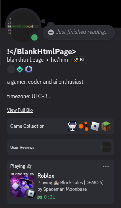

# soblox-rpc

[](https://github.com/BlankHtmlPage/soblox-rpc/actions/workflows/debug.yml)
[](https://github.com/BlankHtmlPage/soblox-rpc/releases)
[](LICENSE)

Sober-style Discord Rich Presence for Roblox. Shows what Roblox game you're playing on your Discord profile. (Good way to troll your friends!)



## Features

- Shows "Playing Roblox" on your Discord profile
- Displays the game name you're currently playing
- Shows the game creator's name
- Live elapsed time counter
- Game thumbnail as large image
- Roblox logo as small image
- "View Game Page" button linking to the Roblox game page

## Prerequisites

- Rust (install via [rustup](https://rustup.rs/))
- Discord desktop client running (PTB, Canary supported)

## Discord Application Setup

Before using this tool, you need to create a Discord application:

1. Go to [Discord Developer Portal](https://discord.com/developers/applications)
2. Click **"New Application"**
3. Name it **`Roblox`** (exact name matters — this is what shows in your profile)
4. Go to **Rich Presence** → **Art Assets**
5. Click **"Add Image(s)"** and upload [`app_assets/roblox_logo.png`](app_assets/roblox_logo.png)
6. Name the asset **`roblox_logo`** (must match exactly)
7. Go to **General Information** and copy the **Application ID**

## Installation

### From Source

```bash
git clone https://github.com/BlankHtmlPage/soblox-rpc.git
cd soblox-rpc
cargo build # Debug build
cargo build --release # Release build
```

The binary will be at `target/debug/soblox-rpc` for the debug build and `target/release/soblox-rpc` for the release build.

### Pre-built Binaries

Download the latest release from [GitHub Releases](https://github.com/BlankHtmlPage/soblox-rpc/releases).

## Usage

```bash
soblox-rpc -u <UNIVERSE_ID> -c <CLIENT_ID>
```

### Finding the Universe ID

Every Roblox game has a place ID in its URL. Use the Roblox API to get the universe ID:

```bash
# Replace PLACE_ID with the number from the game URL
curl "https://apis.roblox.com/universes/v1/places/PLACE_ID/universe"
```

Or run this in your browser console on the game page:

```javascript
fetch(`https://apis.roblox.com/universes/v1/places/${window.location.pathname.split('/')[2]}/universe`)
  .then(r => r.json())
  .then(d => console.log(d.universeId))
```

### Examples

```bash
# Brookhaven RP
soblox-rpc -u 4252370513 -c 123456789012345678

# Block Tales
soblox-rpc -u 5678284602 -c 123456789012345678
```

### CLI Options

| Flag | Description | Required |
|------|-------------|----------|
| `-u, --universe-id` | Roblox universe ID | yes |
| `-c, --client-id` | Discord application client ID | yes |
| `-h, --help` | Print help | — |

## Building

### Debug Build

```bash
cargo build
# Binary: target/debug/soblox-rpc
```

### Release Build

```bash
cargo build --release
# Binary: target/release/soblox-rpc
```

### Optimized Release

```bash
cargo build --release
strip target/release/soblox-rpc
```

## Cross-Compilation

```bash
# Linux
cargo build --release --target x86_64-unknown-linux-gnu

# macOS
cargo build --release --target x86_64-apple-darwin

# Windows
cargo build --release --target x86_64-pc-windows-msvc
```

## How It Works

1. Fetches game info (name, creator) from the Roblox API
2. Fetches game thumbnail from the Roblox API
3. Connects to Discord's local IPC socket
4. Sends `SET_ACTIVITY` with the game data
5. Handles heartbeats to maintain the connection
6. Clears activity on exit

## License

MIT License — see [LICENSE](LICENSE) for details.

## Acknowledgments

- [discord-presence](https://crates.io/crates/discord-presence) — Rust Discord RPC library
